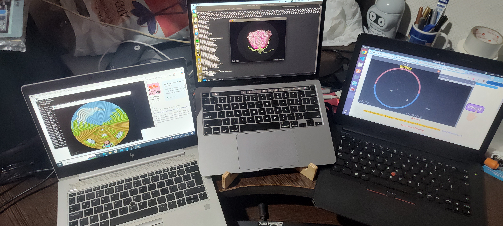

# Making games for Ventilastation

This folder is the documentation for **game developers**. If you want to
work on vsdk itself — the runtime, emulators, editors, protocols, native
apps — head to [internals/](internals/README.md) instead.

## The path

1. **Install the emulator** so you can run games on your computer — no
   hardware needed:
   - [Linux setup](emulator-setup.Linux.md)
   - [macOS setup](emulator-setup.macOS.md)
   - [Windows setup](emulator-setup.Windows.md)

   Start it any time afterwards with `./vs-emu.sh` (or `vs-emu.bat`).
   There is also a browser-based emulator with a built-in code and sprite
   editor — no install at all — published from this repo (see the
   [project README](../README.md)).

2. **Read the [developers guide](developers-guide.md).** It walks the
   whole way: cloning a minimal game, the folder layout, Scenes and the
   director, Sprites and the circular display, images, sounds, and getting
   your game onto the menu. That one document is most of what you need.

3. **Poke at real games.** `games/alecu/ventap` is the smallest complete
   game; `games/alecu/vyruss` shows most of the API in anger. The
   `tutorial` system app (in the emulator's hidden system menu) lets you
   move sprites around interactively to understand the coordinate system.

4. **Submit your game** as a GitHub pull request — see the last section of
   the developers guide.

## Quick facts

- Games are MicroPython. One folder per game under
  `games/<group>/<name>/`, holding `code/`, `images/`, `sounds/`, a
  `menu.png` icon and a `meta.json`.
- The display is polar: 54 LEDs from center to edge × 256 angular steps.
  You draw with up to 100 hardware-accelerated `Sprite`s; PNG assets are
  compiled into ROM files automatically when the emulator starts.
- Your game appears in the console menu just by existing: the launcher
  discovers `games/*/*/` folders and orders them by `meta.json`. No
  launcher code to edit.
