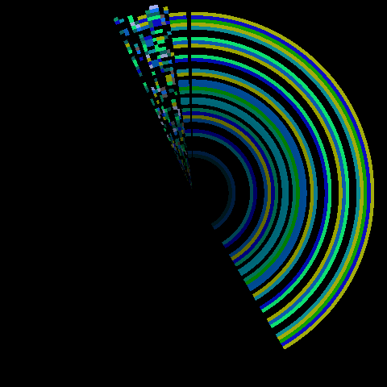
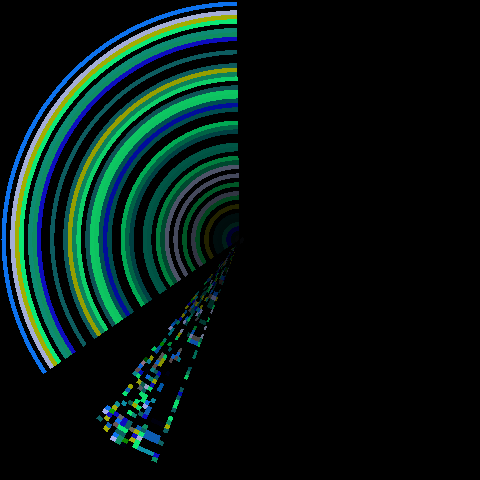

# OTA ring sprite corruption — hand-off

Status as of 2026-07-26: **fixed, verified on hardware.** The GC-lifetime
bug below is real and worth having (the fix for it shipped alongside the
real one), but hardware testing showed it wasn't what was actually causing
the corruption — see "The real cause" at the end of this doc, which follows
the same pattern [menu-sprite-corruption.md](menu-sprite-corruption.md)'s
own Bug #3 section used: two real, independently-worthwhile fixes that
turned out not to be the story, kept below for the record. See
[ota-progress-rings-plan.md](ota-progress-rings-plan.md) for the original
feature request this was blocking, and [ota.md](ota.md)'s "On-device
progress display" section for how the finished feature works end to end.

## The symptom

`vsdk_ota_rings.py` (see [ota.md](ota.md)) renders OTA progress as
concentric single-LED rings via `vshw_vs2` sprites. On real hardware,
during an actual partition write, the rings that should be clean
concentric bands instead show a chaotic patch of random-colored single-LED
noise speckles — not a coherent ring at all — localized to part of the
arc, with the rest of the arc showing clean bands. Screenshots from the
2026-07-26 hardware session (captured via the workbench, see
[workbench.md](workbench.md) and `tools/pov_screenshot.py`) showed this
consistently across multiple captures during the same partition-write OTA;
the user independently flagged it from the screenshots without seeing this
doc first ("the sprites might have been replaced with any other memory
content") — that description is exactly right, see below.




This is very likely **the same bug shape already investigated and fixed
once before in this codebase**, in a different file:
[menu-sprite-corruption.md](menu-sprite-corruption.md)'s "Bug #1" and
"Bug #3". Read that doc first — it has the debugging technique and the
exact fix pattern this bug almost certainly also needs.

## Root cause (strong lead, not yet hardware-confirmed)

`vshw_sprites.set_imagestrip()` (native, `hardware/rotor/modules/povdisplay/
sprites.c`) stores only the raw C pointer extracted from whatever Python
buffer object it's given — it never keeps the owning `mp_obj_t` alive (this
is documented in `sprites.c` and is exactly what
[menu-sprite-corruption.md](menu-sprite-corruption.md)'s Bug #1 already
describes for `director.py`). If nothing on the Python side retains that
buffer object, MicroPython's GC is free to reclaim and reuse its memory
later, while the sprite's cached `image_strip` pointer keeps pointing at
it — and the next `render_vs2()` draws whatever now occupies that address.

`vsdk_ota_rings.py`'s `_set_ring()` (line ~181) does exactly this:

```python
_sprites.set_imagestrip(_STRIP_SLOT[name], _build_ring_strip(name, row))
```

`_build_ring_strip()` returns a freshly allocated `bytes` object built
inline as a call argument. Nothing stores it anywhere — `_row[name]` only
tracks the row *number*, not the buffer. As soon as `set_imagestrip()`
returns, that `bytes` object has zero references and is immediately
GC-eligible.

`director.py`'s fix for the identical problem was a module-level
`self._stripe_buffers = {}` dict, keyed by slot number, populated
alongside every `set_imagestrip()` call, specifically to keep a live Python
reference for as long as the slot is in use. `vsdk_ota_rings.py` has no
equivalent — there is no dict anywhere in the module that roots a strip
buffer.

**This is not a "might eventually get collected" risk — it's
near-immediate and deterministic**, because `updater.py`'s own partition
write loop calls `gc.collect()` explicitly, once per HTTP chunk, in the
exact same loop that calls into the ring functions:

```python
def write_chunk(chunk):
    ...
    if block_pos == _BLOCK:
        part.writeblocks(offset // _BLOCK, block_buf)
        ...
        vsdk_ota_rings.pulse_partition_activity()        # <- builds + sets a fresh, unrooted strip
        vsdk_ota_rings.set_partition_progress(done_blocks, total_blocks)  # <- and another one

for pct in _http_stream(url, write_chunk, size):
    _progress("writing", name, pct)
    gc.collect()   # <- runs right after write_chunk(), while the strip(s) just set have zero refs
```

(`apps/micropython/updater.py`, `_update_partitions()`.) This lines up
exactly with the symptom: the corrupted screenshots were all captured
during a partition write (the gray/yellow rings), which is the one phase
with an explicit `gc.collect()` sitting immediately after the ring update
call. The file-sync loop (`_sync_lfs_files()`, white/green rings) has no
equivalent per-chunk `gc.collect()` in its download loop — only before
hashing a file that needs re-verification — so it may be less reliably
affected, or affected on a longer delay; that's a prediction to check on
hardware, not something already confirmed either way.

## Suggested fix (not implemented, not tested)

Mirror `director.py`'s pattern in `vsdk_ota_rings.py`: add a module-level
dict that roots each slot's current buffer for as long as it's in use,
e.g.

```python
_strip_buffer = {}  # name -> bytes, keeps set_imagestrip()'s buffer GC-rooted

def _set_ring(name, row):
    ...
    built = _build_ring_strip(name, row)
    _strip_buffer[name] = built          # keep alive before/alongside the native call
    _sprites.set_imagestrip(_STRIP_SLOT[name], built)
    sprite.set_frame(0)
    sprite.set_flags(_VS2_FLAG_VISIBLE)
```

Total footprint: 5 ring slots × `WIDTH * PIXELS` bytes (256×54 = 13,824)
plus a 4-byte header ≈ 68 KB worst case, all five held at once — cheap on
this board.

After applying, re-run the same kind of hardware test that reproduced the
bug (see below) and confirm the rings render as clean, stable bands
through a real partition write, not just briefly after each update. If
they still glitch, don't assume this was the whole story — go straight to
the debugging technique in
[menu-sprite-corruption.md](menu-sprite-corruption.md)'s "Bug #3" section
before spending time on other theories: add `mp_printf(&mp_plat_print, ...)`
logging (**not** `ESP_LOGD`/`ESP_LOGW` — this board's ESP-IDF console is
wired to UART0, not the USB-Serial-JTAG port the REPL/mpremote actually
reads, so `ESP_LOG*` output is invisible over USB here, a gotcha that cost
real time last time) in `gpu.c`'s `render_vs2()` to print each ring
sprite's cached `image_strip` pointer plus header fields
(`frame_width`/`frame_height`/`palette`) on change, and watch for the same
signature as before: a stable address whose *content* changes underneath
it.

## How to reproduce on hardware

This uses the workbench rig — see [workbench.md](workbench.md) for how it
taps the DUT's LED bus and re-streams it over Wi-Fi, and
`tools/pov_screenshot.py --help` for the capture tool itself.

1. Force a real partition write so the gray/yellow rings actually run
   long enough to capture: pick a **safe, currently-inactive** partition —
   `prboom-go`, `retro-core`, or `fmsx`, whichever the board is *not*
   currently booted from (check with
   `mpremote exec "import esp32; print(esp32.Partition(esp32.Partition.RUNNING).info()[4])"`
   first) — and erase it, e.g.
   `esptool.py --port <port> erase_region <offset> <size>` for that
   partition's entry in the partition table CSV, or corrupt a few bytes.
   **Never erase the partition reported as `RUNNING`** — that bricks the
   board's current boot target; this happened once already this session
   and was recovered via `make flash-full`, see `ota.md`'s history/git log
   if the details matter.
2. Optionally also drop a stale/wrong entry into `/.vsdk_lfs_cache.json`
   or corrupt a couple of small LFS files if you also want to exercise the
   white/green file-sync rings in the same run.
3. Trigger the OTA exactly once, then go hands-off: `mpremote` always
   sends Ctrl-C on connect, which can interrupt an in-progress OTA if you
   run another `mpremote exec` to "check on it" mid-flight (this cost real
   time earlier this session — don't do it). The working pattern:
   - One `mpremote exec` call that writes `/ota_request` (or whatever
     currently triggers the in-place path in `main.py` — check
     `_check_ota_boot()`) and returns.
   - Then an explicit `esptool.py ... --after hard_reset run` (or just let
     the board's own hardware reset happen) — do **not** issue a further
     `mpremote` command after this until the test is over.
   - Then run a passive, non-interrupting observer: a plain pyserial
     reader (no Ctrl-C, reconnect-on-drop) is safer than repeated
     `mpremote` calls for watching boot logs live.
4. While that runs, repeatedly call
   `python3 tools/pov_screenshot.py --no-launch --out <path>.png` (no
   `--slug`/launch — this just captures whatever the display is currently
   showing) every second or two, across the whole OTA. Expect ~20-30
   captures for a partition write that takes tens of seconds.
5. Inspect the captures for: clean concentric bands (fixed) vs. localized
   noise speckle within an otherwise-clean ring (still broken — the
   speckle is real corrupted content, not just the capture method's
   normal cross-revolution smearing artifact, which produces stepped/
   doubled bands rather than per-pixel random color noise).

## Files involved

| File | Role |
|---|---|
| `apps/micropython/vsdk_ota_rings.py` | `_set_ring()`/`ensure_started()` — both fixes (buffer-rooting dicts, `memoryview(...)` wraps) live here |
| `apps/micropython/updater.py` | Calls into the ring functions; the `gc.collect()` in `_update_partitions()`'s write loop is what made the GC-lifetime theory look so plausible |
| `hardware/rotor/modules/povdisplay/sprites.c` | `set_imagestrip()`/`memoryview_data()` — the actual bug: casts to `mp_obj_array_t*` and reads `items+free`, valid only for a real memoryview/bytearray |
| `hardware/rotor/modules/povdisplay/gpu.c` | `render_vs2()` — where a bad pointer actually gets drawn |
| `docs/internals/menu-sprite-corruption.md` | The prior investigation of the same two bug shapes (GC lifetime *and* this exact type confusion, as its own Bug #2) in a different file |

## The real cause: Bug #2's type confusion, not GC lifetime

The GC-lifetime fix above shipped (it's real, and cheap insurance — see
`director.py`'s own belt-and-suspenders use of both fixes together for the
same reason), but a hardware re-test after applying it *alone* still showed
the identical corruption, unchanged. That ruled it out the same way
[menu-sprite-corruption.md](menu-sprite-corruption.md)'s own bug #1 fix got
ruled out there: same symptom, same timing, before and after.

The actual bug is `menu-sprite-corruption.md`'s **Bug #2**, independently
rediscovered here: `vshw_sprites.set_imagestrip()` and
`vshw_povdisplay.set_palettes()` both read their argument via
`memoryview_data()` (`sprites.c`):

```c
const char* memoryview_data(mp_obj_t mv_obj) {
    mp_obj_array_t *mv = MP_OBJ_TO_PTR(mv_obj);
    return ((char*)mv->items) + mv->free;
}
```

This casts straight to `mp_obj_array_t*` and reads `items + free` as the
data pointer. `free` is a valid element offset only for a real
`memoryview`/`bytearray`. For a plain `bytes` object, that identical struct
slot holds the object's eagerly-computed hash instead — so passing plain
`bytes` (as both `_build_ring_strip()` and `_build_palette()` originally
did) makes the native side compute `items + <hash value used as a byte
offset>`: an address that's *wrong*, not merely *stale*. Confirmed directly
on hardware via temporary counters in `render_vs2()` (since removed):
100% of draws showed a garbage header, from the very first draw of each
sprite, with a *stable* address across the whole session — the opposite of
what a GC-reclaim signature would look like (which should start valid and
go bad later, once something else's allocation lands on the freed memory).
A stable-but-wrong address from the first draw onward means the address
was never right in the first place.

**Fix:** wrap both builders' return values in `memoryview(...)` before they
reach `set_imagestrip()`/`set_palettes()` — the exact fix
`director.py`'s `_load_rom_streaming()` already uses for the same pair of
calls (see its own comment there). `_build_ring_strip()`/`_build_palette()`
now return a plain `bytearray` (not `bytes`) for this reason, and every
call site wraps it in `memoryview(...)` right before the native call.

**Verified on hardware**, twice, isolating the two ring families
separately: a real partition-write OTA (gray/yellow) and a real LFS
cache-wipe forcing a full file re-sync (white/green) both produced clean,
stable, correctly-colored concentric bands throughout, with zero noise —
a clear improvement over the pre-fix screenshots this doc originally
included.

One anomaly worth a footnote: a single much longer combined test (full
cache wipe + all three partitions corrupted in one session) once showed no
rings at all for its ~45s duration (not corrupted — just absent, starfield
never disabled). Not reproduced in two separate follow-up isolation tests.
Later traced to a *different*, real issue: `ensure_started()`'s very first
call after a hard reset can itself fail (some dependency isn't consistently
ready yet), which is normally masked by however long WiFi/manifest/LFS-scan
takes naturally, giving it many later chances — see `ota.md`'s "On-device
progress display" section for how that's handled now (`_wifi_connect()`
re-asserts the ring/label state every attempt, not just once).
